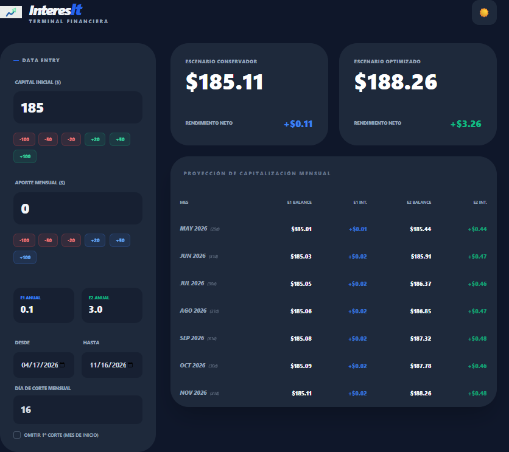
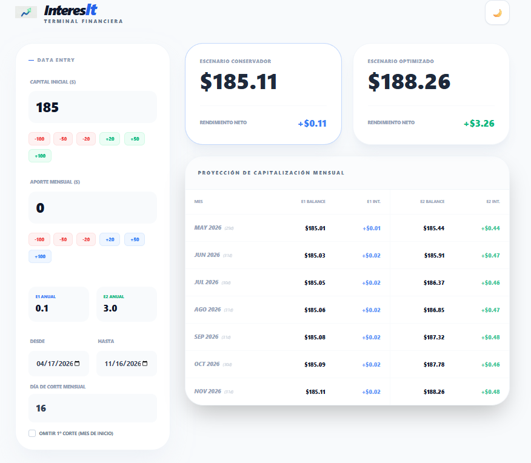

# InteresIt: Terminal Financiera

**InteresIt** es una herramienta financiera avanzada (y visualmente elegante) diseñada para proyectar el crecimiento de tu capital a través del tiempo, aprovechando el poder del interés compuesto. Fue construida para contrastar, de un solo vistazo, la diferencia de rendimientos entre múltiples estrategias, como un **Escenario Conservador** frente a un **Escenario Optimizado**.

## 📸 Vistazo a la Interfaz

La aplicación cuenta con un diseño premium y soporta nativamente ambos temas visuales para adaptarse a tus preferencias:

### Modo Oscuro

### Modo Claro

## 🎯 ¿Qué te permite hacer?

La aplicación calcula con altísima precisión el interés compuesto basándose en **fechas exactas y la cantidad real de días por mes** (incluyendo años bisiestos), para que puedas visualizar la evolución realista de tus inversiones.

### Principales Funcionalidades:

*   💰 **Proyección Dinámica de Aportes:** Introduce tu *Capital Inicial* y tu *Aporte Mensual*. Contarás con "chips" interactivos rápidos (+20, -50, etc.) para jugar con tus números sin tener que teclear.
*   📊 **Comparación Simultánea de Escenarios:** Configura libremente la tasa anual de interés para un Escenario E1 y otro E2 para descubrir qué estrategia multiplica mejor tus finanzas y cuál es tu rendimiento neto final.
*   📅 **Gestión de Tiempos Realistas:**
    *   Selecciona libremente un horizonte de inversión indicando las fechas de inicio (**Desde**) y de finalización (**Hasta**).
    *   **Día de Corte Mensual:** Simula el comportamiento real de las instituciones financieras eligiendo el día exacto del mes en que tu cuenta hace el corte de saldo para recalcular el interés.
    *   **Omitir 1º corte:** Permite la opción específica de saltarse el primer corte para ajustar el cálculo cuando inicias una inversión tarde en el mes vigente.
*   📈 **Reporte de Capitalización Mensual:** Ofrece una tabla comparativa desglosada que expone, mes con mes, el saldo y el interés acumulado ganado de acuerdo al número de días específicos de cada intervalo.
*   🌓 **Modo Oscuro/Claro Interactivo:** Interfaz moderna y orientada al usuario con un diseño "Premium", transiciones suaves y capacidades de alternar la ambientación para trabajar a cualquier hora del día.

## 🚀 ¿Cómo se usa?

¡El uso es completamente dinámico y los cálculos se actualizan al instante!

1.  **Ingresa tu Capital:** En la sección "Data Entry", coloca con cuánto dinero cuentas hoy en el campo *Capital Inicial*.
2.  **Define el Ahorro Recurrente:** Especifica cuánto puedes ahorrar periódicamente en *Aporte Mensual*.
3.  **Determina las Tasas:** Rellena "E1 Anual" y "E2 Anual" con los porcentajes de rendimiento neto anual esperado de los instrumentos financieros que estás estudiando.
4.  **Elige tu Horizonte:** Emplea los calendarios para fijar el tiempo de la inversión. 
5.  **Alinea tus Cortes:** ¿Tu cuenta paga intereses los días 1 de cada mes? Colócalo en *Día de Corte Mensual*.
6.  **¡Estudia tu Futuro!:** Analiza inmediatamente los grandes marcadores de tu dinero, tu "Rendimiento Neto" (pura ganancia) y el desglose en la gran tabla inferior.

---

> **Nota:** La aplicación es un "Single Page Application" o App de página única y corre 100% en el dispositivo del usuario. Todo tu análisis es completamente privado y seguro, no se requiere instalación y funciona directamente desde cualquier navegador moderno.
